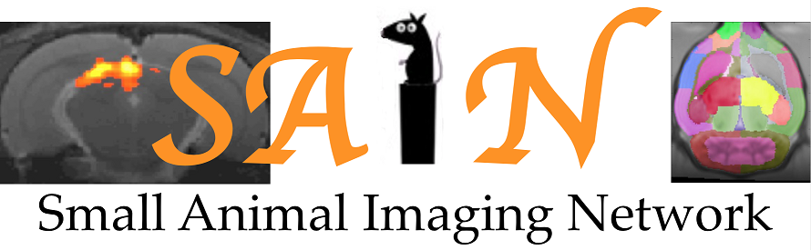

Le réseau SAIN (Small Animal Imaging Network), qui regroupe au niveau national des
scientifiques impliqués dans l’imagerie du petit animal, organise des Séminaires
Avancés en Imagerie in vivo du Petit Animal [SAIPAs](#Séminaires-Avancés-en-Imagerie-in-vivo-du-Petit-Animal)

### Laboratoires associés
- [**CREFE**](https://anexplo.genotoul.fr/exploration-non-invasive/) / [**ToNIC**](https://tonic.inserm.fr/) - Toulouse
- [**CRMBM**](https://crmbm.univ-amu.fr/) - Marseille
- [**CRMSB**](https://www.rmsb.u-bordeaux.fr/fr/) - Bordeaux
- [**CYCERON**](https://www.cyceron.fr/) - Caen
- [**GIN**](https://tinyurl.com/d9vx4b3h) - Grenoble
- [**ICM (CENIR)**](https://institutducerveau-icm.org/en/cenir-irm-en/) - Paris
- [**ICube**](https://icube.unistra.fr/) - Strasbourg
- [**IHU LIRYC**](https://www.ihu-liryc.fr/les-plateformes-de-recherche-et-dinnovation/#1) - Pessac
- [**IVIA**](https://ivia.uca.fr/) - Clermont-ferrand
- [**CRI**](https://cri1149.fr/) / [**FRIM**](https://plateformes.u-paris.fr/federation-de-recherche-en-imagerie-multimodale-frim/) - Paris

[Plus d'informations](Laboratoire.md)

## Prochain évènements

- **27-29 Mars 2023 :** [SFRMBM2023](https://www.sfrmbm2023.fr/), le SAIN fera sa réunion de réseau lors du congrès le 29 mars après-midi.

## Evènements passés

- **22 Novembre 2022:** Meeting du SAIN à l'ICM (Paris)

## Compte rendu des réunions

Prochaine réunion le **29 Mars 2023 de 13h30 à 17h**

[Lien vers les derniers compte-rendu](https://github.com/SAIN-IMAGING/WIKI-SAIN/tree/main/CR)

## Séminaires Avancés en Imagerie in vivo du Petit Animal

Les SAIPAs sont constitués de webinaires qui se succèderont sur trois thèmes :

- S1 : Développement de séquences avancées d’acquisition d’image IRM. Responsables : Emeline Ribot
& Aurélien Trottier (RMSB, Bordeaux), Denis Grenier (Creatis, Lyon) + un correspondant Bruker.

- S2 : Prétraitement et visualisation des images. Responsables : Benjamin Lemasson (GIN, Grenoble),
Sébastien Mériaux (NeuroSpin, Saclay), Sorina Pop (Créatis Lyon).

- S3 : Méthodes d’analyse à base d’apprentissage machine. Responsables : Benjamin Lemasson (GIN,
Grenoble), Vincent Noblet (Icube, Strabourg), Sorina Pop (Créatis Lyon).

Le public visé est les étudiants et chercheurs impliqués dans des projets reposant sur l’imagerie petit
animal et intéressés par les techniques avancées d’acquisition de traitement et d’analyse de ces
images.

Les objectifs des SAIPAs sont multiple : valoriser et diffuser l’expertise des membres du groupe SAIN,
former les chercheurs aux techniques avancées dans le domaine de l’imagerie in vivo du petit animal
et sensibiliser les participants au partage de données et d’outils dans ce domaine (respect de la politique
des 3R, open data, traçabilité des traitements). Les SAIPAs bénéficieront de l’infrastructure FLI-IAM
pour la gestion des données et l’exécution des pipelines.

Le premier webinaire prévu dans le cadre de S2 Prétraitement et la visualisation des images est prévu
le 19 Mai 2022 (détail ci-dessous). D’autres suivront à l’automne !

Ce premier webinaire sera sur MP3, un logiciel open source, destiné aux traitements d’images
précliniques et cliniques développé au Grenoble Institut des Neurosciences.

**Objectifs :** Présentation et prise en main de MP3 : un logiciel open source destiné aux
traitements d’images précliniques et cliniques.
Cette boîte à outils Matlab propose une interface graphique dédiée au traitement des images médicales.
Voici les outils les plus importants inclus dans MP3
i) Le chargement et la conversion des images médicales (ex. DICOM, NIFTI, Bruker, …) au format
nifti/json
ii) Un visualisateur d’images (données 2D à 5D)
iii) Une interface graphique permettant de créer et exécuter des pipelines d’analyses complexes (par
exemple, du recalage, des calculs de cartes paramétriques…)
iv) des outils d’analyses d’images (ex. ROIs, nuages de points, …)

Volume horaire : 1/2 journée (19 Mai 2022 13h30-17h30)
Matériel : Un ordinateur avec Matlab 2017 (ou plus) + toolbox image processing + java 8 (ou plus)
Présentateurs : Benjamin Lemasson (CR Inserm), Clément Brossard (doctorant) et Aurélien Delphin
(Doctorant)
Références : Brossard et al. Frontiers in Neuroinformatics 2021 ; https://github.com/nifm-gin/MP3

Inscription via : https://survey.creatis.insa-lyon.fr/index.php/129184?lang=fr
